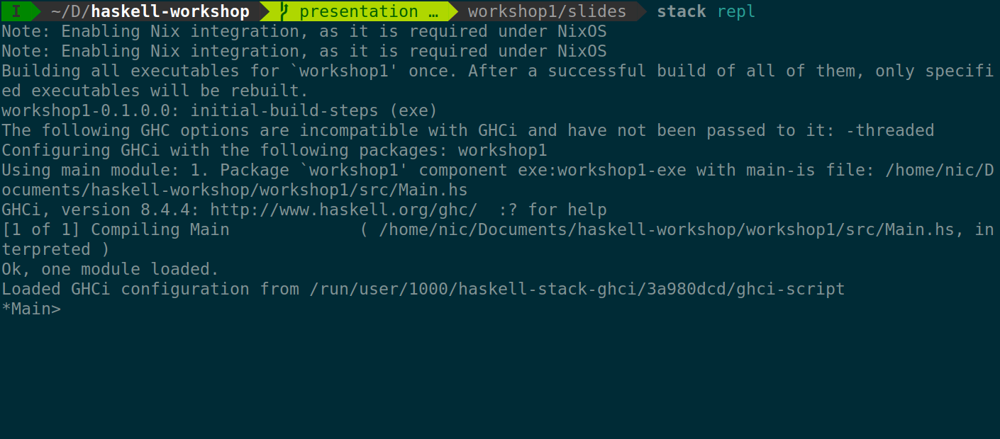
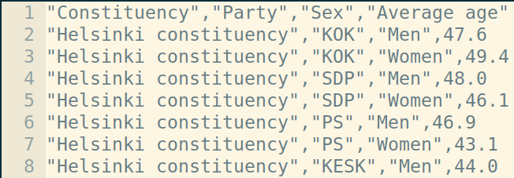
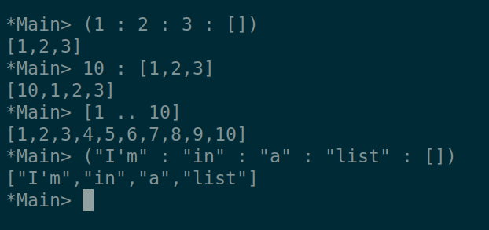

## The Goal

Develop a complete Haskell program that converts CSV data to JSON.


##

{ height=90% }

## The Plan

1) Haskell Development Environment
2) Hello World and some Syntax
3) The Data Model
4) Data Transformation
5) Connecting to the Outside
6) Conclusion

# The Haskell Development Environment

## Setting up your environment

- Go to [the Github repo](https://github.com/relex/haskell-workshop) for the workshop
(https://github.com/relex/haskell-workshop)

- Clone it locally

- Go to workshop1/Exercise.md

- Complete "Set up tooling" section

## Stack

* One of Haskell's build tools.
* To build a project: `stack build`
* To access the REPL: `stack repl`



# Hello Syntax

## Playing with the REPL

* Useful tool to try things out parts of your program
* Extensively used in the workshop

<!-- Live REPL Coding
* Let binding
* Numbers & mathematical operators
* Strings
* Defining a function
-->

## Hello World

* Open src/Main.hs
* Run in the REPL by typing `:main`

```haskell
main :: IO ()
main = putStrLn "Hello World!"
```

* `main` is special:
  - Present in every Haskell program
  - No arguments
  - Performs an IO action

* Change the text and run it in the REPL

## Functions and Types

* The primary way of defining computation is with **functions**
* **Types** describe the inputs and outputs of functions
* Types are **enforced** by the compiler
* Working with two languages at once :)

```haskell
identity :: Int -> Int
identity x = x

hello :: String -> String
hello name = "Hello, " ++ name

addInt :: Int -> Int -> Int
addInt x y = x + y
```

Add these ^ to a file and try them out!

## A First Function

* A function that converts (some) integers to words
* Pattern matching

```haskell
intToWord :: Int -> String
intToWord 1 = "one"
intToWord 2 = "two"
intToWord 3 = "three"
intToWord _ = "dunno"
```

* Try and write `wordToInt :: String -> Int`

## Polymorphic Types

* Some functions have the same behaviour for values of different types
  * E.g. the `identity` function
* Can generalise functions by using *type variables*

```haskell
identity :: a -> a
identity x = x
```

* Can also *constrain* the type variables

```haskell
add :: Num a => a -> a -> a
add x y = x + y
```

* These constraints can be defined using *type classes*

## Composition

* Using the output of one function as the input of another function: *"chaining functions together"*
* Use the dot *operator* for composition

```haskell
f :: Int -> String
f x = intToWord x

g :: String -> Int
g x = wordToInt x

h :: Int -> Int
h = g . f

(.) :: (b -> c) -> (a -> b) -> a -> c
(.) f g x = g (f x)
```


# The Data Model

## Goal

* Create a data structure that accurately models the data
* Introduce `Maybe`
* Introduce lists

### Approach

* Define a model for a single row of data (a candidate)
* Apply this model to all the rows


## A Single Candidate



* A candidate has 4 attributes:
  - constituency
  - party
  - sex
  - average age

* Need a way of grouping these together

## Data Types

A simple data type:

```haskell
data Person = MakePerson
  { name :: String
  , age  :: Int
  } deriving Show
```

* `Person` is the type being defined
* `MakePerson` is the constructor function
* `name, age` are fields with associated types
* `deriving Show` allows the use of the `show` function
  * `show` converts structure to a string

## Working with Data Types

* Creating a new data type:

```haskell
MakePerson :: String -> Int -> Person
```
* Accessing the data type:

```haskell
name :: Person -> String
age :: Person -> Int
```


## The Maybe Type

* What happens if we cannot parse a candidate?
* Need some way to represent an invalid row:

```haskell
data Maybe a = Nothing | Just a
```

* `Maybe` is the type being defined
* `a` is a *type variable* (could be any type)
* `Nothing, Just` are *both* constructors

## The List Type

* How do we represent a list of candidates?
* Use singly-linked lists:
  * `[]` is the empty list
  * `:` lets you append values to the front
  * `[a,b,c]` == `(a : b : c : [])`

{ height=40% }

## The Data Model

* Define our basic candidate type

```haskell
data Candidate = Candidate
  { ...
  } deriving Show
```

## The Data Model

* Define our basic candidate type

```haskell
data Candidate = Candidate
  { constituency :: String
  , party        :: String
  , sex          :: String
  , averageAge   :: Double
  } deriving Show
```

## The Data Model

* Define our basic candidate type

```haskell
data Candidate = Candidate
  { constituency :: String
  , party        :: String
  , sex          :: String
  , averageAge   :: Double
  } deriving Show
```

* Add a notion of failure

## The Data Model

* Define our basic candidate type

```haskell
data Candidate = Candidate
  { constituency :: String
  , party        :: String
  , sex          :: String
  , averageAge   :: Double
  } deriving Show
```

* Add a notion of failure

```haskell
type DataModel = Maybe Candidate
```

## The Data Model

* Define our basic candidate type

```haskell
data Candidate = Candidate
  { constituency :: String
  , party        :: String
  , sex          :: String
  , averageAge   :: Double
  } deriving Show
```

* Add a notion of failure

```haskell
type DataModel = Maybe Candidate
```

* Create a list of candidates

## The Data Model

* Define our basic candidate type

```haskell
data Candidate = Candidate
  { constituency :: String
  , party        :: String
  , sex          :: String
  , averageAge   :: Double
  } deriving Show
```

* Add a notion of failure

```haskell
type DataModel = Maybe Candidate
```

* Create a list of candidates

```haskell
type DataModel = [Maybe Candidate]
```


# Data Transformation

## Goal

* Write some functions to:
  * Convert CSV into data model
  * Convert data model into JSON
* Demonstrate power of `Generic`
* Introduce `map`

### Approach

* Write a function `parseLine :: CSVLine -> Maybe Candidate`
* Write a function `parseFile :: CSV -> DataModel`
* Generate a function `encode :: DataModel -> JSON`
* Apply these to every row


## Writing `parseLine :: CSVLine -> Maybe Candidate`

```haskell
type CSVLine = String -- type alias

parseLine :: CSVLine -> Maybe Candidate
parseLine line = makeCandidate (undefined)

makeCandidate :: [String] -> Maybe Candidate
makeCandidate fields = undefined

fromMaybeAge
  :: (Double -> Candidate)
  -> Maybe Double
  -> Maybe Candidate
fromMaybeAge partialCandidate maybeAge = undefined
```

* `_` means "for every other value"
* `splitOn` splits a string into a list of strings on a character
* `readMaybe` decodes a double from a string (may fail)


## Writing `parseLine :: CSVLine -> Maybe Candidate`

Our solution:

```haskell
parseLine :: CSVLine -> Maybe Candidate
parseLine line = makeCandidate (splitOn ',' line)

makeCandidate :: [String] -> Maybe Candidate
makeCandidate [c, p, s, a] =
  fromMaybeAge (Candidate c p s) (readMaybe a)
makeCandidate _ = Nothing

fromMaybeAge
  :: (Double -> Candidate)
  -> Maybe Double
  -> Maybe Candidate
fromMaybeAge partialCandidate Nothing  = Nothing
fromMaybeAge partialCandidate (Just a) = Just (partialCandidate a)
```


## Stripping Quotes

```haskell
stripQ :: String -> String
stripQ = undefined
  where
    leftStrip :: String -> String
    leftStrip ('"' : xs) = xs
    leftStrip xs         = xs

    rightStrip :: String -> String
    rightStrip = undefined
```

* Use `leftStrip` and `reverse` to implement `rightStrip`
* Use `leftStrip` and `rightStrip` to implement `stripQ`
* `reverse` reverses items in a list
* `where` used to define local functions

## Stripping Quotes

Our solution:
```haskell
stripQ :: String -> String
stripQ = leftStrip . rightStrip
  where
    leftStrip :: String -> String
    leftStrip ('"' : xs) = xs
    leftStrip xs         = xs

    rightStrip :: String -> String
    rightStrip = reverse . leftStrip . reverse
```

* Point-free style: composition FTW!

## Improving `parseLine`

* Using `stripQ` to improve `makeCandidate`

```haskell
...

makeCandidate :: [String] -> Maybe Candidate
makeCandidate [c, p, s, a] =
  let c' = stripQ c
      p' = stripQ p
      s' = stripQ s
  in fromMaybeAge (Candidate c' p' s') (readMaybe a)
makeCandidate _ = Nothing

...
```

* `let ... in ...` binding useful to split up functions


## The `map` function

* How do we apply `parseLine` to every row?
* Use `map`, a *higher-order function*
  * Takes two inputs: a function and a list.
  * Applies the function to every item in the list

```haskell
map :: (a -> b) -> [a] -> [b]
map f []     = []
map f (x:xs) = f x : map f xs
```

* Defined using *recursion*


## Writing `parseFile :: CSV -> DataModel`

* We are ready to write the full parser function:

```haskell
type CSV = String
type DataModel = [Maybe Candidate]

parseFile :: CSV -> DataModel
parseFile = undefined
```

* `lines` splits strings into lines
* `tail` removes the first item in a list
* Try and use point-free style

## Writing `parseFile :: CSV -> DataModel`

Our solution:

```haskell
parseFile :: CSV -> DataModel
parseFile = map parseLine . tail . lines
```


## Generating `encode :: DataModel -> JSON`

```haskell
{-# LANGUAGE DeriveGeneric #-}
main Main where

import           GHC.Generics
import qualified Data.Aeson      as JSON
import qualified Data.ByteString as B

data Candidate = Candidate
  { ...
  } deriving (Show, Generic)

instance Aeson.ToJSON Candidate
```

* Language extensions expand the Haskell language
* `Data.Aeson` provides encoding to and from JSON
* `Data.ByteString` provides efficient binary strings

## Generating `encode :: DataModel -> JSON`

```haskell
type JSON = ByteString
```

* `encode` outputs efficient binary strings
* Try it out in the REPL!


# Connecting to the Outside

## Goal

* Write a complete program!
* Introduce IO and do notation

### Approach

* Introduce purity and impurity
* Write main function


## Purity in Haskell

* All functions we have written in the previous section are *pure*
* A pure function **always** returns the same *output* when given the same *input*
* This behaviour is *enforced by the compiler*
* Why?
  * Code is easier to refactor and reason about
  * Interactions with the outside world are more explicit
  * Easy to test
* Pure functions cannot interact with the world
* So how do we communicate with the outside world?


## IO

* Communication with the outside handled through IO
* Impurity is **always** explicitly encoded in the types

{ width=100% }


## Do notation

```haskell
askName :: IO ()
askName = do
  putStrLn "Enter your name:"
  name <- getLine
  let reversedName = reverse name
  putStrLn ("Your name reversed: " ++ reversedName)
```

* `putStrLn` prints a string
* `getLine` gets a line of input from the user
* Do blocks are a special Haskell syntax impure programming
  * Always start with the `do` keyword
  * Functions executed top-to-bottom
  * Return values stored in local variables using `(<-)`
  * `let` used for pure computation


## Read / Write

```haskell
convert :: String -> IO ()
convert filename = do
  undefined
```

* `readFile` returns the contents of a file as a String
* `B.writeFile` writes a ByteString to a file

## Read / Write

Our Solution:

```haskell
convert :: String -> IO
convert filename = do
  csv <- readFile filename
  let json = JSON.encode (parseFile csv)
  B.writeFile "output.json" json
```


## The Complete App

* Get the filename from the arguments:

```haskell
main :: IO ()
main = do
  args <- getArgs
  case args of
    [filename] -> convert filename
    _          -> putStrLn "Call only with filename"
```

* And we have a complete Haskell app!! :D 


# Conclusion

## Conclusion

* Functions ... functions everywhere
* Types are useful to keep track of functions
* Abstraction makes things easier to think about
* Split problem into data model and data transformation
* Keep core logic pure, minimize IO and impurity


## Challenges

## Further Reading

##


